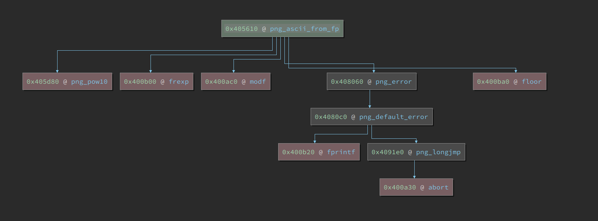

# BNCallGraph
Yet another simple _callgraph plugin_ for Binary Ninja.
The plugin constructs and visualize a callgraph starting from the current function, using the FlowGraph APIs.

# Commands
- **Compute callgraph**: Compute and visualize a callgraph starting from the current function, following calls. The callgraph contains all the functions reachable starting from the current function.
- **Compute calleegraph**: Compute and visualize a callgraph starting from the current function, following xrefs. The callgraph contains all the functions that reaches the current function.

# Settings
- **Colorize Leaves**: Mark nodes without outgoing edges in red.
- **Colorize Root**: Mark current function in green.
- **Show Indirect Calls**: Show indirect calls as undefined blocks in the callgraph.

# Minumum Version
Tested on `dev-1.2.1987` with `python 3.6.9`.
